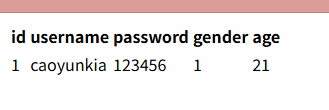

# Html

**超文本标记语言**（英语：**H**yper**T**ext **M**arkup **L**anguage，简称：**HTML**）是一种用于创建[网页](https://zh.wikipedia.org/wiki/网页)的标准[标记语言](https://zh.wikipedia.org/wiki/标记语言)。HTML是一种基础技术，常与[CSS](https://zh.wikipedia.org/wiki/CSS)、[JavaScript](https://zh.wikipedia.org/wiki/JavaScript)一起被众多网站用于设计网页、网页应用程序以及移动应用程序的用户界面[[3\]](https://zh.wikipedia.org/zh-cn/HTML#cite_note-3)。[网页浏览器](https://zh.wikipedia.org/wiki/网页浏览器)可以读取HTML文件，并将其渲染成可视化网页。HTML文件以“.htm”和“.html”为文件名，是一种纯文本文件，可以使用记事本、写字板等文本编辑器进行编辑，也可以使用Frontpage、Dreamweaver等网页制作软件进行快速创建与编辑。HTML描述了一个网站的结构语义随着线索的呈现，使之成为一种标记语言而非[编程语言](https://zh.wikipedia.org/wiki/编程语言)。

[HTML元素](https://zh.wikipedia.org/wiki/HTML元素)是构建网站的基石。HTML允许嵌入图像与对象，并且可以用于创建交互式表单，它被用来结构化信息——例如标题、段落和列表等等，也可用来在一定程度上描述文档的外观和[语义](https://zh.wikipedia.org/wiki/语义)。HTML的语言形式为[尖括号](https://zh.wikipedia.org/wiki/括号)包围的HTML元素（如`<html>`），浏览器使用HTML标签和脚本来诠释网页内容，但不会将它们显示在页面上。

HTML可以嵌入如[JavaScript](https://zh.wikipedia.org/wiki/JavaScript)的[脚本语言](https://zh.wikipedia.org/wiki/脚本语言)，它们会影响HTML网页的行为。网页浏览器也可以引用[层叠样式表](https://zh.wikipedia.org/wiki/层叠样式表)（CSS）来定义文本和其它元素的外观与布局。维护HTML和CSS标准的组织[万维网联盟](https://zh.wikipedia.org/wiki/万维网联盟)（W3C）鼓励人们使用CSS替代一些用于表现的HTML元素[[4\]](https://zh.wikipedia.org/zh-cn/HTML#cite_note-deprecated-4)。

## Table

在html中，通过<table>标签来表示表格，使用<tr>表示一行数据，<td>表示一行数据中的一列数据

```html
<table>
    <thead>
                <tr>
                    <th>id</th>
                    <th>username</th>
                    <th>password</th>
                    <th>gender</th>
                    <th>age</th>
                </tr>
        </thead>
        <tbody>
                <tr>
                    <td>1</td>
                    <td>caoyunkia</td>
                    <td>123456</td>
                    <td>1</td>
                    <td>21</td>
                </tr>
            </tbody>
</table>
```



为了区分表头和数据，可以使用<thead>和<tbody>, 使用<th>可以加粗字体，用于区分表头元素和数据元素。


### 表格的属性

| 属性名      | 属性值              | 描述                                  |
| ----------- | ------------------- | ------------------------------------- |
| align       | left、center、right | 表格相对周围元素的对齐方式            |
| border      | 1或“”               | 表格是否拥有边框                      |
| cellpadding | 像素值              | 单元边沿于其内容之间的空白，默认1像素 |
| cellspacing | 像素值              | 规定单元格之间的空白，默认2像素       |
| width       | 像素值              | 规定表格的宽度                        |


## 