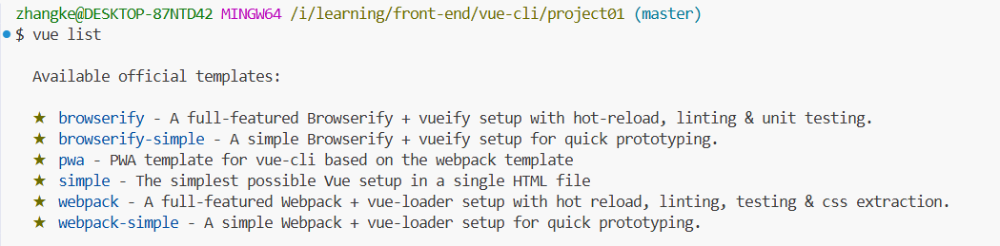
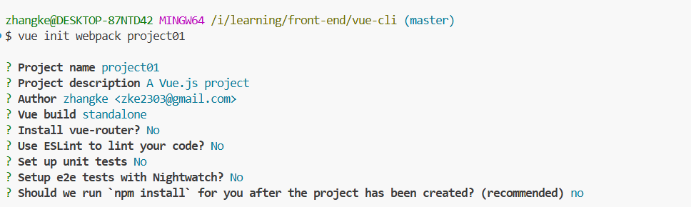

# Vue-Cli

Vue CLI 是一个基于 Vue.js 进行快速开发的完整系统，提供：

- 通过 `@vue/cli` 实现的交互式的项目脚手架。

- 通过 `@vue/cli` + `@vue/cli-service-global` 实现的零配置原型开发。

- 一个运行时依赖 (

  ```shell
  @vue/cli-service
  ```

  )，该依赖：

  - 可升级；
  - 基于 webpack 构建，并带有合理的默认配置；
  - 可以通过项目内的配置文件进行配置；
  - 可以通过插件进行扩展。

- 一个丰富的官方插件集合，集成了前端生态中最好的工具。

- 一套完全图形化的创建和管理 Vue.js 项目的用户界面。

Vue CLI 致力于将 Vue 生态中的工具基础标准化。它确保了各种构建工具能够基于智能的默认配置即可平稳衔接，这样你可以专注在撰写应用上，而不必花好几天去纠结配置的问题。与此同时，它也为每个工具提供了调整配置的灵活性，无需 eject。


## 第一个Vue-cli程序

1、通过`npm`下载`cnpm`

```shell
npm install cnpm -g
```


2、通过`cnpm`下载`vue-cli`

```shell
cnpm install vue-cli -g
```


3、可以通过`vue list`查看，可以基于哪些模版创建vue应用

```shell
vue list
```




4、通过 `webpack` 模版创建vue-cli应用

```shell
vue init webpack peoject
```




5、进入 `project` 项目， 执行`npm install`下载依赖包

```shell
npm install
```


6、启动vue-cli项目

```shell
npm run dev
```

