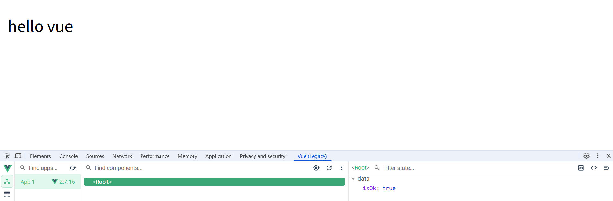
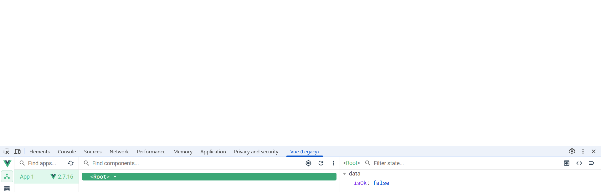
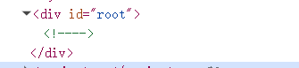

# Vue

Vue (读音 /vjuː/，类似于 **view**) 是一套用于构建用户界面的**渐进式框架**。与其它大型框架不同的是，Vue 被设计为可以自底向上逐层应用。Vue 的核心库只关注视图层，不仅易于上手，还便于与第三方库或既有项目整合。另一方面，当与[现代化的工具链](https://v2.cn.vuejs.org/v2/guide/single-file-components.html)以及各种[支持类库](https://github.com/vuejs/awesome-vue#libraries--plugins)结合使用时，Vue 也完全能够为复杂的单页应用提供驱动。


## Vue的安装

### 1、直接用 `<script>` 引入

直接下载并用 `<script>` 标签引入，`Vue` 会被注册为一个全局变量。

对于制作原型或学习，你可以这样使用最新版本：

```html
<script src="https://cdn.jsdelivr.net/npm/vue@2.7.16/dist/vue.js"></script>
```

对于生产环境，我们推荐链接到一个明确的版本号和构建文件，以避免新版本造成的不可预期的破坏：

```html
<script src="https://cdn.jsdelivr.net/npm/vue@2.7.16"></script>
```

如果你使用原生 ES Modules，这里也有一个兼容 ES Module 的构建文件：

```html
<script type="module">
  import Vue from 'https://cdn.jsdelivr.net/npm/vue@2.7.16/dist/vue.esm.browser.js'
</script>
```

你可以在 [cdn.jsdelivr.net/npm/vue](https://cdn.jsdelivr.net/npm/vue/) 浏览 NPM 包的源代码。

Vue 也可以在 [unpkg](https://unpkg.com/vue@2.7.16/dist/vue.js) 和 [cdnjs](https://cdnjs.cloudflare.com/ajax/libs/vue/2.7.16/vue.js) 上获取 (cdnjs 的版本更新可能略滞后)。


### 2、NPM

在用 Vue 构建大型应用时推荐使用 NPM 安装[[1\]](https://v2.cn.vuejs.org/v2/guide/installation.html#footnote-1)。NPM 能很好地和诸如 [webpack](https://webpack.js.org/) 或 [Browserify](http://browserify.org/) 模块打包器配合使用。同时 Vue 也提供配套工具来开发[单文件组件](https://v2.cn.vuejs.org/v2/guide/single-file-components.html)。

```shell
# 最新稳定版
$ npm install vue@^2
```


## 初识Vue
### 起步

```js
<!DOCTYPE html>
<html lang="en">
<head>
    <meta charset="UTF-8">
    <meta name="viewport" content="width=device-width, initial-scale=1.0">
    <title>Document</title>
    <script src="https://cdn.jsdelivr.net/npm/vue@2.7.16" type="text/javascript"></script> <!-- 引入vue -->
</head>
<body>
    <div id="root">
        <h1>Hello {{language}}</h1>
    </div>
    <script type="text/javascript">
        new Vue({
            el: "root",
            data: {
                language: "Vue"
            }
        })
    </script>
</body>
</html>
```


Vue.js 的核心是一个允许采用简洁的模板语法来声明式地将数据渲染进 DOM 的系统：

```html
<div id="app">
  {{ message }}
</div>
```


```js

var app = new Vue({
  el: '#app',
  data: {
    message: 'Hello Vue!'
  }
})
```


> 注意：然后在html中，有一个多个DOM容器绑定同一个vue实例，只有第一个定义的DOM容器的实例才会是vue生效。
>
> 一个DOM容器，只能被一个Vue实例接管。
>
> ==容器和DOM容器==必须是一对一的关系

## 模板语法

Vue.js 使用了基于 HTML 的模板语法，允许开发者声明式地将 DOM 绑定至底层 Vue 实例的数据。所有 Vue.js 的模板都是合法的 HTML，所以能被遵循规范的浏览器和 HTML 解析器解析。

在底层的实现上，Vue 将模板编译成虚拟 DOM 渲染函数。结合响应系统，Vue 能够智能地计算出最少需要重新渲染多少组件，并把 DOM 操作次数减到最少。

如果你熟悉虚拟 DOM 并且偏爱 JavaScript 的原始力量，你也可以不用模板，[直接写渲染 (render) 函数](https://v2.cn.vuejs.org/v2/guide/render-function.html)，使用可选的 JSX 语法。

### 插值

Vue模版语法有两大类：

1. 插值语法：

   ​	功能： 用户解析标签体内容

   ​	语法：{{xxx}}， xxx是js表达式，且可以直接读取到vue中的data中所有属性

   ​	举例:

   ```html
   <!DOCTYPE html>
   <html lang="en">
   <head>
       <meta charset="UTF-8">
       <meta name="viewport" content="width=device-width, initial-scale=1.0">
       <title>Document</title>
       <script src="../js/vue.min.js" type="text/javascript"></script>
   </head>
   <body>
       <div id="root">
           <h1>Hello {{language}}</h1>
       </div>
       <script type="text/javascript">
           new Vue({
               el: "#root",
               data: {
                   language: "Vue",
               }
           })
       </script>
   </body>
   </html>
   ```

   

2. 指令语法：

   ​	功能：用户解析标签（包括：标签属性、标签体内容、绑定事件....）

   ​	语法：v-bind:属性='xxx', xxx是js表达式, 可以简写为: :属性='xxx'。

   ​	举例:

   ```html
   <!DOCTYPE html>
   <html lang="en">
   <head>
       <meta charset="UTF-8">
       <meta name="viewport" content="width=device-width, initial-scale=1.0">
       <title>Document</title>
       <script src="../js/vue.min.js" type="text/javascript"></script>
   </head>
   <body>
       <div id="root">
           <a v-bind:href="url">google</a>
       </div>
       <script type="text/javascript">
           new Vue({
               el: "#root",
               data: {
                   url: "http://www.google.com"
               }
           })
       </script>
   </body>
   </html>
   ```

> 对于所有的数据绑定，Vue.js 都提供了完全的 JavaScript 表达式支持。
>
> 模板表达式都被放在沙盒中，只能访问[全局变量的一个白名单](https://github.com/vuejs/vue/blob/v2.6.10/src/core/instance/proxy.js#L9)，如 `Math` 和 `Date` 。你不应该在模板表达式中试图访问用户定义的全局变量。


### 指令

指令 (Directives) 是带有 `v-` 前缀的特殊 attribute。指令 attribute 的值预期是**单个 JavaScript 表达式** (`v-for` 是例外情况，稍后我们再讨论)。指令的职责是，当表达式的值改变时，将其产生的连带影响，响应式地作用于 DOM。

```html
<p v-if="isOk">hello vue</p>
```

```js
var vm = new Vue({
    el: '#root',
    data: {
        isOk: true
    }
})
```

这里，`v-if` 指令将根据表达式 `isOk` 的值的真假来插入/移除 `<p>` 元素。







看上述图片，如果isOk为false的话，`<p>`标签直接没有显示，在html元素中也没有`<p>`这个标签，而不是元素不显示。


#### 参数

一些指令能够接收一个“参数”，在指令名称之后以冒号表示。例如，`v-bind` 指令可以用于响应式地更新 HTML attribute：

```html
<a v-bind:href="url">...</a>
```

```js
var vm = new Vue({
    el: '#root',
    data: {
        url: "http://www.google.com"
    }
})
```

在这里 `href` 是参数，告知 `v-bind` 指令将该元素的 `href` attribute 与表达式 `url` 的值绑定。

另一个例子是 `v-on` 指令，它用于监听 DOM 事件：

```html
<a v-on:click="doSomething">...</a>
```

在这里参数是监听的事件名。我们也会更详细地讨论事件处理。


#### 动态参数

> 2.6.0 新增

从 2.6.0 开始，可以用方括号括起来的 JavaScript 表达式作为一个指令的参数：

```html
<!--
注意，参数表达式的写法存在一些约束，如之后的“对动态参数表达式的约束”章节所述。
-->
<a v-bind:[attributeName]="url"> ... </a>
```

```js
var vm = new Vue({
    el: '#root',
    data: {
        attributeName: "href"
    }
})
```

这里的 `attributeName` 会被作为一个 JavaScript 表达式进行动态求值，求得的值将会作为最终的参数来使用。例如，如果你的 Vue 实例有一个 `data` property `attributeName`，其值为 `"href"`，那么这个绑定将等价于 `v-bind:href`。

> 注意：在html中，是不区分大小写的，而js中是区分大小的的，因此在上述案例中，是无法正常显示的，因为在html中变量名是`attributeName`,其实它实际的变量名是`attributename`.因此要想上述的代码正常生效，需要将vue中data.attributeName的属性名改成`attributename`.


#### 修饰符

修饰符 (modifier) 是以半角句号 `.` 指明的特殊后缀，用于指出一个指令应该以特殊方式绑定。例如，`.prevent` 修饰符告诉 `v-on` 指令对于触发的事件调用 `event.preventDefault()`：

```
<form v-on:submit.prevent="onSubmit">...</form>
```

在接下来对 [`v-on`](https://v2.cn.vuejs.org/v2/guide/events.html#事件修饰符) 和 [`v-for`](https://v2.cn.vuejs.org/v2/guide/forms.html#修饰符) 等功能的探索中，你会看到修饰符的其它例子。


#### 缩写

`v-` 前缀作为一种视觉提示，用来识别模板中 Vue 特定的 attribute。当你在使用 Vue.js 为现有标签添加动态行为 (dynamic behavior) 时，`v-` 前缀很有帮助，然而，对于一些频繁用到的指令来说，就会感到使用繁琐。同时，在构建由 Vue 管理所有模板的[单页面应用程序 (SPA - single page application)](https://en.wikipedia.org/wiki/Single-page_application) 时，`v-` 前缀也变得没那么重要了。因此，Vue 为 `v-bind` 和 `v-on` 这两个最常用的指令，提供了特定简写：

##### `v-bind` 缩写

```
<!-- 完整语法 -->
<a v-bind:href="url">...</a>

<!-- 缩写 -->
<a :href="url">...</a>

<!-- 动态参数的缩写 (2.6.0+) -->
<a :[key]="url"> ... </a>
```

##### `v-on` 缩写

```html
<!-- 完整语法 -->
<a v-on:click="doSomething">...</a>

<!-- 缩写 -->
<a @click="doSomething">...</a>

<!-- 动态参数的缩写 (2.6.0+) -->
<a @[event]="doSomething"> ... </a>
```

它们看起来可能与普通的 HTML 略有不同，但 `:` 与 `@` 对于 attribute 名来说都是合法字符，在所有支持 Vue 的浏览器都能被正确地解析。而且，它们不会出现在最终渲染的标记中。缩写语法是完全可选的，但随着你更深入地了解它们的作用，你会庆幸拥有它们。


### 指令详解

##### v-model

`v-model` 的本质是 Vue 提供的语法糖（Syntactic Sugar），它简化了将数据层 (`data`) 和视图层 (`DOM`) 保持同步的过程：

1. **数据到视图：** 当 `data` 中的值发生变化时，输入框的值（视图）会自动更新。
2. **视图到数据：** 当用户在输入框中输入内容时（视图变化），对应的 `data` 属性值也会自动更新。

> 注意：`v-model`主要用于在 **表单输入元素** 或 **组件** 上创建 **双向数据绑定**。因为`v-model`的作用是进行双向绑定，因此它绑定的元素必须是可以修改的，而在html中，只有form中的元素可以进行修改，所以，`v-model`只能用在form元素中，用于绑定form元素中的value属性。

```html
<body>
    <div id="root">
        <p>username: <input type="text" v-model="username"></p>
        <p>{{username}}</p>
    </div>
    <script>
        var vm = new Vue({
            el: "#root",
            data: {
                username: "zke2303"
            }
        })
    </script>
</body>
```

## 计算属性和侦听器

### 计算属性

模板内的表达式非常便利，但是设计它们的初衷是用于简单运算的。在模板中放入太多的逻辑会让模板过重且难以维护。例如：

```html
<div id="root">
  {{ message.split('').reverse().join('') }}
</div>
```

在这个地方，模板不再是简单的声明式逻辑。你必须看一段时间才能意识到，这里是想要显示变量 `message` 的翻转字符串。当你想要在模板中的多处包含此翻转字符串时，就会更加难以处理。

所以，对于任何复杂逻辑，你都应当使用**计算属性**。

#### 基础例子

```html
<div id="root">
  <p>Original message: "{{ message }}"</p>
  <p>Computed reversed message: "{{ reversedMessage }}"</p>
</div>
```

```js
var vm = new Vue({
  el: '#root',
  data: {
    message: 'Hello'
  },
  computed: {
    // 计算属性的 getter
    reversedMessage: function () {
      // `this` 指向 vm 实例
      return this.message.split('').reverse().join('')
    }
  }
})
```

结果：

Original message: "Hello"

Computed reversed message: "olleH"

这里我们声明了一个计算属性 `reversedMessage`。我们提供的函数将用作 property `vm.reversedMessage` 的 getter 函数：

```js
console.log(vm.reversedMessage) // => 'olleH'
vm.message = 'Goodbye'
console.log(vm.reversedMessage) // => 'eybdooG'
```

你可以打开浏览器的控制台，自行修改例子中的 vm。`vm.reversedMessage` 的值始终取决于 `vm.message` 的值。

你可以像绑定普通 property 一样在模板中绑定计算属性。Vue 知道 `vm.reversedMessage` 依赖于 `vm.message`，因此当 `vm.message` 发生改变时，所有依赖 `vm.reversedMessage` 的绑定也会更新。而且最妙的是我们已经以声明的方式创建了这种依赖关系：计算属性的 getter 函数是没有副作用 (side effect) 的，这使它更易于测试和理解。

> 注意：计算属性默认不接受任何参数。它通过访问 `this.data` 中的响应式数据来自动计算并返回结果。


#### 计算属性缓存 vs 方法

你可能已经注意到我们可以通过在表达式中调用方法来达到同样的效果：

```html
<p>Reversed message: "{{ reversedMessage() }}"</p>
// 在组件中
methods: {
  reversedMessage: function () {
    return this.message.split('').reverse().join('')
  }
}
```

我们可以将同一函数定义为一个方法而不是一个计算属性。两种方式的最终结果确实是完全相同的。然而，不同的是**计算属性是基于它们的响应式依赖进行缓存的**。只在相关响应式依赖发生改变时它们才会重新求值。这就意味着只要 `message` 还没有发生改变，多次访问 `reversedMessage` 计算属性会立即返回之前的计算结果，而不必再次执行函数。

这也同样意味着下面的计算属性将不再更新，因为 `Date.now()` 不是响应式依赖：

```js
computed: {
  now: function () {
    return Date.now()
  }
}
```

相比之下，每当触发重新渲染时，调用方法将**总会**再次执行函数。

我们为什么需要缓存？假设我们有一个性能开销比较大的计算属性 **A**，它需要遍历一个巨大的数组并做大量的计算。然后我们可能有其他的计算属性依赖于 **A**。如果没有缓存，我们将不可避免的多次执行 **A** 的 getter！如果你不希望有缓存，请用方法来替代。

> 总计：计算属性缓存 vs 方法， 它们最大的区别在于，计算属性是有缓存的，只要属性值不发生变化，不管怎么重新渲染，都不会重新进行计算。
>
> 它们的调用方式也不同，调用方法是，需要在方法名后面加(), 而计算属性不需要。

```html
<body>
    <div id="root">
        <p>method: {{getDate()}}</p>
        <p>computed: {{getDate1}}</p>
    </div>
    <script>
        var vm = new Vue({
            el: "#root",
            data: {
            },
            methods:{
                getDate:function(){
                    return Date.now()
                }
            },
            computed:{
                getDate1:function(){
                    return Date.now()
                }
            }
        })
    </script>   
</body>
```


#### 计算属性 vs 侦听属性

Vue 提供了一种更通用的方式来观察和响应 Vue 实例上的数据变动：**侦听属性**。当你有一些数据需要随着其它数据变动而变动时，你很容易滥用 `watch`——特别是如果你之前使用过 AngularJS。然而，通常更好的做法是使用计算属性而不是命令式的 `watch` 回调。细想一下这个例子：

```js
<div id="demo">{{ fullName }}</div>
var vm = new Vue({
  el: '#demo',
  data: {
    firstName: 'Foo',
    lastName: 'Bar',
    fullName: 'Foo Bar'
  },
  watch: {
    firstName: function (val) {
      this.fullName = val + ' ' + this.lastName
    },
    lastName: function (val) {
      this.fullName = this.firstName + ' ' + val
    }
  }
})
```

上面代码是命令式且重复的。将它与计算属性的版本进行比较：

```js
var vm = new Vue({
  el: '#demo',
  data: {
    firstName: 'Foo',
    lastName: 'Bar'
  },
  computed: {
    fullName: function () {
      return this.firstName + ' ' + this.lastName
    }
  }
})
```

好得多了，不是吗？


#### 计算属性的 setter

计算属性默认只有 getter，不过在需要时你也可以提供一个 setter：

```js
// ...
computed: {
  fullName: {
    // getter
    get: function () {
      return this.firstName + ' ' + this.lastName
    },
    // setter
    set: function (newValue) {
      var names = newValue.split(' ')
      this.firstName = names[0]
      this.lastName = names[names.length - 1]
    }
  }
}
// ...
```

现在再运行 `vm.fullName = 'John Doe'` 时，setter 会被调用，`vm.firstName` 和 `vm.lastName` 也会相应地被更新。


#### watch

`watch` 是一个 Vue 实例的选项，它允许您**观察** Vue 实例上的响应式数据（`data`、`props` 或 `computed` 属性）的变化，并在数据发生变化时执行自定义的逻辑。

通俗的来讲，`watch`就是一个监听器，用户监听 Vue 实例中的响应式数据（`data`、`props` 或 `computed` 属性），当这些响应式属性发生变化时，执行对于的监听器.

```html
<body>
    <div id="root">
        <p>firstName: <input type="text" v-model="firstName"></p>
        <p>lastName: <input type="text" v-model="lastName"></p>
        <p>fullName: {{fullName}}</p>
    </div>
    <script>
        var vm = new Vue({
            el: "#root",
            data: {
                firstName: "yun kai",
                lastName: "Cao",
                fullName: 'Cao yun kai'
            },
            watch:{
                firstName: function(val){
                    this.fullName = val + ' ' + this.lastName
                },
                lastName: function(val){
                    this.fullName = this.firstName + ' ' + val
                }
            }
        })
    </script>
    
</body>
```
